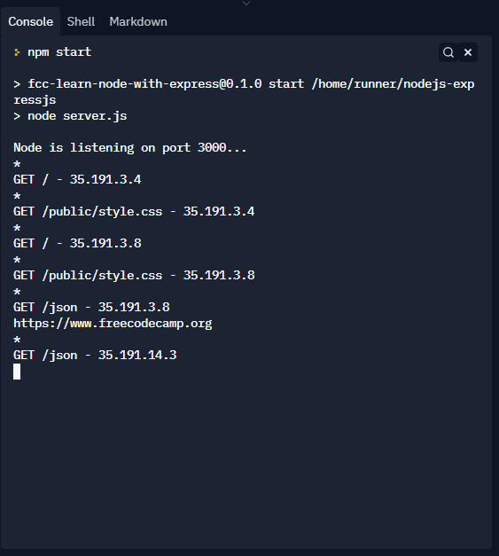
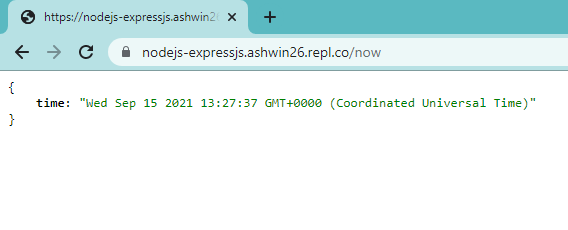
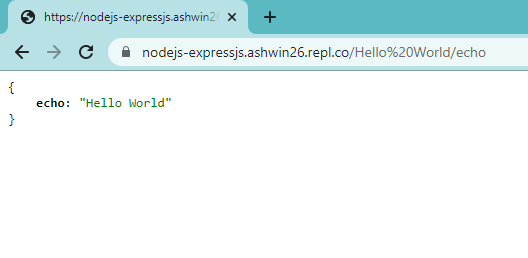
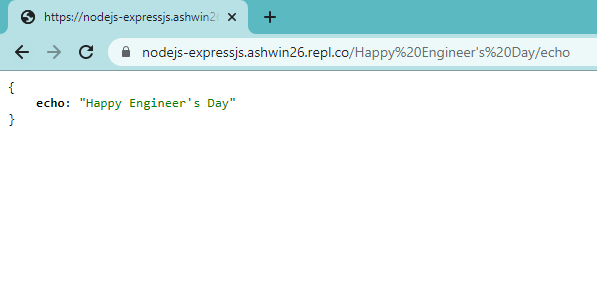
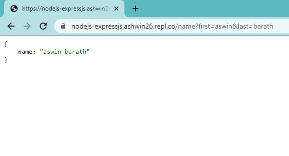
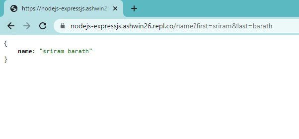
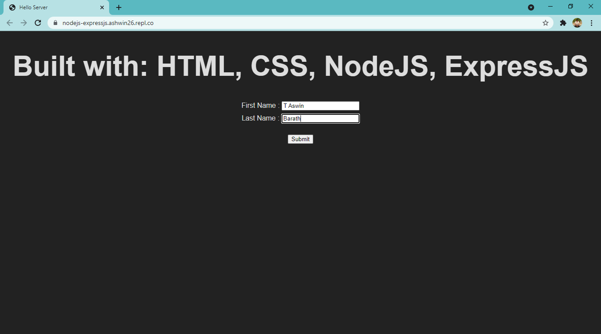
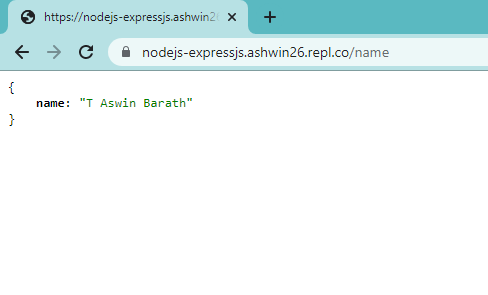

# NodeJS and ExpressJS scripts

<p>

</p>


- **Node.js** is a JavaScript runtime that allows developers to write backend (server-side) programs in **JavaScript**. 
- **Node.js** comes with a handful of built-in modules — small, independent programs — that help with this. 
- Some of the core modules include HTTP, which acts like a server, and File System, a module to read and modify files.


- **Express** is a lightweight web application framework, and is one of the most popular packages on npm. 
- **Express** makes it much easier to create a server and handle routing for your application, which handles things like direct people to the correct page when they visit a certain endpoint.


- The following scripts cover the basics of Node and Express including how to create a server, serve different files, and handle different requests from the browser.

---

## Source: freeCodeCamp course
- [Back End Development and APIs](https://www.freecodecamp.org/learn/back-end-development-and-apis)
- [Basic Node and Express](https://www.freecodecamp.org/learn/back-end-development-and-apis/#basic-node-and-express)

---

## Express app object

- To create an Express app object we use `require` to import and `express()` function to initialize the app

```aidl
var express = require('express');
var app = express();

```

- This object has several methods
- One fundamental method is `app.listen(port)`. 
- It tells your server to listen on a given port, putting it in running state.


## Express routes

- In Express, routes takes the following structure: 

`app.METHOD(PATH, HANDLER)`

- METHOD is an http method in lowercase. 
- PATH is a relative path on the server (it can be a string, or even a regular expression). 
- HANDLER is a function that Express calls when the route is matched. 
- Handlers take the form 

`function(req, res) {...}`, 

- where `req` is the request object, and `res` is the response object.
- For example, the handler:

```aidl
function(req, res) {
  res.send('Response String');
}
```

- will serve the string 'Response String'.


### Challenge 1

- Use the app.get() method to serve the string "Hello Express" to GET requests matching the / (root) path.
- Be sure that your code works by looking at the logs, then see the results in the preview if you are using Replit.


- Code

```aidl
var express = require('express');
var app = express();

app.get('/', function(req, res) {
	res.send("Hello Express");
});

module.exports = app;
```

- Output

<p>

</p>


## Serve an HTML File
- You can respond to requests with a file using the res.sendFile(path) method. 
- You can put it inside the app.get('/', ...) route handler. 
- Behind the scenes, this method will set the appropriate headers to instruct your browser on how to handle the file you want to send, according to its type. Then it will read and send the file. This method needs an absolute file path. We recommend you to use the Node global variable __dirname to calculate the path like this:

`absolutePath = __dirname + relativePath/file.ext`


### Challenge 2

- Send the /views/index.html file as a response to GET requests to the / path. 
- If you view your live app, you should see a big HTML heading (and a form that we will use later…), with no style applied.
- Note: Keep in mind that Express evaluates routes from top to bottom, and executes the handler for the first match. 


- Code

```aidl
var express = require('express');
var app = express();

app.get('/', function(req, res) {
	let path = __dirname + "/views/index.html";
	res.sendFile(path);
});

module.exports = app;
```


- Output

<p>

</p>


## Serve Static Assets

- An HTML server usually has one or more directories that are accessible by the user. 
- You can place there the static assets needed by your application (stylesheets, scripts, images).
- In Express, you can put in place this functionality using the middleware `express.static(path)`, where the `path` parameter is the absolute path of the folder containing the assets.


- Basically, **middleware** are functions that intercept route handlers, adding some kind of information. 
- A middleware needs to be mounted using the method `app.use(path, middlewareFunction)`. 
- The first path argument is optional. If you don’t pass it, the middleware will be executed for all requests.


### Challenge 3

- Mount the `express.static()` middleware to the path `/public` with `app.use()`. 
- The absolute path to the assets folder is `__dirname + /public`.
- Now your app should be able to serve a CSS stylesheet. 


- Code

```aidl
var express = require('express');
var app = express();

let path = __dirname + "/public";
app.use("/public", express.static(path));

module.exports = app;
```


- Output

<p>

</p>


## Serve JSON on a Specific Route
- While an HTML server serves HTML, an API serves data. 
- A REST (REpresentational State Transfer) API allows data exchange in a simple way, without the need for clients to know any detail about the server. 
- The client only needs to know where the resource is (the URL), and the action it wants to perform on it (the verb). 
- The GET verb is used when you are fetching some information, without modifying anything. 


- These days, the preferred data format for moving information around the web is JSON. 
- Simply put, JSON is a convenient way to represent a JavaScript object as a string, so it can be easily transmitted.


- Let's create a simple API by creating a route that responds with JSON at the path `/json`. 
- You can do it as usual, with the `app.get()` method. 
- Inside the route handler, use the method `res.json()`, passing in an object as an argument. 
- This method closes the request-response loop, returning the data. 
Behind the scenes, it converts a valid JavaScript object into a string, then sets the appropriate headers to tell your browser that you are serving JSON, and sends the data back.


- A valid object has the usual structure `{key: data}`. 
- data can be a number, a string, a nested object or an array. 
- data can also be a variable or the result of a function call, in which case it will be evaluated before being converted into a string.


### Challenge 4

- Serve the object `{"message": "Hello json"}` as a response, in JSON format, to GET requests to the `/json` route. 
- Then point your browser to `your-app-url/json`, you should see the message on the screen.


- Code

```aidl
var express = require('express')
var app = express();

var helloObj = {"message": "Hello json"};
app.get('/json', function(req, res) {
	res.json(helloObj);
});

module.exports = app;
```


- Output

<p>

</p>


## Use the .env File

- The `.env` file is a hidden file that is used to pass environment variables to your application. 
- This file is secret, no one but you can access it, and it can be used to store data that you want to keep private or hidden. 
- For example, you can store API keys from external services or your database URI. 
- You can also use it to store configuration options. By setting configuration options, you can change the behavior of your application, without the need to rewrite some code.


- The environment variables are accessible from the app as `process.env.VAR_NAME`. 
- The `process.env` object is a global Node object, and variables are passed as strings. 
- By convention, the variable names are all uppercase, with words separated by an underscore. 
- The `.env` is a shell file, so you don’t need to wrap names or values in quotes. 
- It is also important to note that *there cannot be space around the equals sign when you are assigning values to your variables*
- e.g. `VAR_NAME=value`. 
- Usually, you will put each variable definition on a separate line.


### Challenge 5

- Create a .env file in the root of your project directory, and store the variable `MESSAGE_STYLE=uppercase` in it.
- Then, in the `/json` GET route handler send the response object's message in uppercase if `process.env.MESSAGE_STYLE` equals uppercase. 
- The response object should either be `{"message": "Hello json"}` or `{"message": "HELLO JSON"}`, depending on the `MESSAGE_STYLE` value.

- Note: If you are using Replit, you cannot create a .env file. Instead, use the built-in SECRETS tab to add the variable.


- Code

```aidl
var express = require('express')
var app = express();

var helloObjLow = {"message": "Hello json"};
var helloObjUp = {"message": "HELLO JSON"};
app.get('/json', function(req, res) {
	const mySecret = process.env['MESSAGE_STYLE']
	if(mySecret == "uppercase") {
		res.json(helloObjUp);
	} else {
		res.json(helloObjLow);
	}
});

module.exports = app;
```


- Output

<p>

</p>


## More about Middleware

- Middleware functions are functions that take 3 arguments: the request object, the response object, and the next function in the application’s request-response cycle. 
- These functions execute some code that can have side effects on the app, and usually add information to the request or response objects.
- They can also end the cycle by sending a response when some condition is met.
- If they don’t send the response when they are done, they start the execution of the next function in the stack.
- This triggers calling the 3rd argument, next().


- Look at the following example:

```aidl
function(req, res, next) {
  console.log("I'm a middleware...");
  next();
}
```

- Let’s suppose you mounted this function on a route. 
- When a request matches the route, it displays the string `“I’m a middleware…”`, then it executes the next function in the stack. 


## Root-Level Request Logger Middleware 
### (Challenge 6)

- In this exercise, you are going to build root-level middleware. 
- Mount a middleware function at root level, using the `app.use(<middleware-function>)` method. 
- In this case, the function will be executed for all the requests, but you can also set more specific conditions. 
- For example, if you want a function to be executed only for POST requests, you could use `app.post(<middleware-function>)`. 
- Analogous methods exist for all the HTTP verbs (GET, DELETE, PUT, …).

- Build a **simple logger**. 
- For every request, it should log to the console a string taking the following format: `method path - ip`. 
- An example would look like this: `GET /json - ::ffff:127.0.0.1`.
- Note that there is a space between method and path and that the dash separating path and ip is surrounded by a space on both sides. 
- You can get the *request method (http verb)*, the *relative route path*, and the *caller’s ip* from the request object using `req.method`, `req.path` and `req.ip`. 
- Remember to call `next()` when you are done, or your server will be stuck forever. 
- Be sure to have the ‘Logs’ opened, and see what happens when some request arrives.

- *Note*: Express evaluates functions in the order they appear in the code. This is true for middleware too. If you want it to work for all the routes, it should be mounted before them.


- Code

```aidl
var express = require('express')
var app = express();

app.use(function(req, res, next) {
	console.log(`${req.method} ${req.path} - ${req.ip}`);
	next();
});

module.exports = app;
```


- Output

<p>

</p>


## Chaining Middleware

- Middleware can be mounted at a specific route using `app.METHOD(path, middlewareFunction)`. 
- Middleware can also be chained inside route definition.

- Look at the following example:
```aidl
app.get('/user', function(req, res, next) {
  req.user = getTheUserSync();  // Hypothetical synchronous operation
  next();
}, function(req, res) {
  res.send(req.user);
});
```

- This approach is useful to split the server operations into smaller units.
- That leads to a better app structure, and the possibility to reuse code in different places. 
- This approach can also be used to perform some validation on the data.
- At each point of the middleware stack you can block the execution of the current chain and pass control to functions specifically designed to handle errors.
- Or you can pass control to the next matching route, to handle special cases.

## Time Server
### (Challenge 7)

- In the route `app.get('/now', ...)` chain a middleware function and the final handler. 
- In the middleware function you should add the current time to the request object in the `req.time` key. You can use `new Date().toString()`. 
- In the handler, respond with a JSON object, taking the structure `{time: req.time}`.


- Code

```aidl
var express = require('express')
var app = express();

app.get('/now', function(req, res, next) { 
	// middleware 1 - Add current time
	req.time = new Date().toString();
	next();
}, function(req, res) { 
	// middleware 2 (handler) - Handle the response
	res.json({time: req.time});
});

module.exports = app;
```


- Output

<p>

</p>


## Get Route Parameter Input from the Client

- When building an API, we have to allow users to communicate to us what they want to get from our service.
- For example, if the client is requesting information about a user stored in the database, they need a way to let us know which user they're interested in.
- One possible way to achieve this result is by using route parameters.
- Route parameters are named segments of the URL, delimited by slashes (/).
- Each segment captures the value of the part of the URL which matches its position.
- The captured values can be found in the `req.params` object.

```
route_path: '/user/:userId/book/:bookId'
actual_request_URL: '/user/546/book/6754'
req.params: {userId: '546', bookId: '6754'}
```


### Challenge 8

- Build an echo server, mounted at the route `GET /:word/echo`.
- Respond with a JSON object, taking the structure `{echo: word}`.
- You can find the word to be repeated at `req.params.word`.
- You can test your route from your browser's address bar, visiting some matching routes, e.g. `your-app-rootpath/freecodecamp/echo`.


- Code

```aidl
var express = require('express')
var app = express();

app.get('/:word/echo', function(req, res) { 
	res.json({echo: req.params.word});
});

module.exports = app;
```


- Output

<p>

</p>

<p>

</p>


## Get Query Parameter Input from the Client

- Another common way to get input from the client is by encoding the data after the route path, using a query string.
- The query string is delimited by a question mark (?), and includes field=value couples.
- Each couple is separated by an ampersand (&).
- Express can parse the data from the query string, and populate the object `req.query`.
- Some characters, like the percent (%), cannot be in URLs and have to be encoded in a different format before you can send them.
- If you use the API from JavaScript, you can use specific methods to encode/decode these characters.

```
route_path: '/library'
actual_request_URL: '/library?userId=546&bookId=6754'
req.query: {userId: '546', bookId: '6754'}
```


### Challenge 9

- Build an API endpoint, mounted at `GET /name`.
- Respond with a JSON document, taking the structure `{ name: 'firstname lastname'}`.
- The first and last name parameters should be encoded in a query string e.g. `?first=firstname&last=lastname`.


- Code

```aidl
var express = require('express')
var app = express();

var handler = function(req, res) {
	res.json({name: `${req.query.first} ${req.query.last}`});
}

app.route('/name').get(handler).post(handler);

module.exports = app;
```


- Output

<p>

</p>

<p>

</p>


## Use body-parser to Parse POST Request

- Besides GET, there is another common HTTP verb, it is POST.
- POST is the default method used to send client data with HTML forms.
- In REST convention, POST is used to send data to create new items in the database (a new user, or a new blog post).
- You don’t have a database in this project, but you can learn how to handle POST requests anyway.

- In these kind of requests, the data doesn’t appear in the URL, it is hidden in the request body.
- The body is a part of the HTTP request, also called the payload.
- Even though the data is not visible in the URL, this does not mean that it is private.
- To see why, look at the raw content of an HTTP POST request:

```
POST /path/subpath HTTP/1.0
From: john@example.com
User-Agent: someBrowser/1.0
Content-Type: application/x-www-form-urlencoded
Content-Length: 20

name=John+Doe&age=25
```

- As you can see, the body is encoded like the query string.
- This is the default format used by HTML forms.
- With Ajax, you can also use JSON to handle data having a more complex structure.
- There is also another type of encoding: `multipart/form-data`.
- This one is used to upload binary files.
- In this exercise, you will use a urlencoded body.
- To parse the data coming from POST requests, you have to install the body-parser package.
- This package allows you to use a series of middleware, which can decode data in different formats.


### Challenge 10

- Install the body-parser module in your package.json.
- Then, require it at the top of the file.
- Store it in a variable named `bodyParser`.
- The middleware to handle urlencoded data is returned by `bodyParser.urlencoded({extended: false})`.
- Pass the function returned by the previous method call to `app.use()`.
- As usual, the middleware must be mounted before all the routes that depend on it.


- **Note**: extended is a configuration option that tells body-parser which parsing needs to be used. When extended=false it uses the classic encoding querystring library. When extended=true it uses qs library for parsing.

- When using `extended=false`, values can be only strings or arrays.
- The object returned when using querystring does not prototypically inherit from the default JavaScript Object, which means functions like hasOwnProperty, toString will not be available.
- The extended version allows more data flexibility, but it is outmatched by JSON.


- Code

```aidl
var express = require('express')
var app = express();

var bodyParser = require('body-parser');
app.use(bodyParser.urlencoded({extended: false}));

module.exports = app;
```


## Get Data from POST Requests
### (Challenge 11)

- Mount a POST handler at the path `/name`.
- It’s the same path as before. We have prepared a form in the html frontpage.
- It will submit the same data of exercise 10 (Query string).
- If the body-parser is configured correctly, you should find the parameters in the object `req.body`.
- Have a look at the usual library example:


```
route: POST '/library'
urlencoded_body: userId=546&bookId=6754
req.body: {userId: '546', bookId: '6754'}
```


- Respond with the same JSON object as before: `{name: 'firstname lastname'}`.
- Test if your endpoint works using the html form we provided in the app frontpage.

### Tips: 
- There are several other http methods other than GET and POST. And by convention there is a correspondence between the http verb, and the operation you are going to execute on the server. The conventional mapping is:

  - POST (sometimes PUT) - Create a new resource using the information sent with the request,

  - GET - Read an existing resource without modifying it,

  - PUT or PATCH (sometimes POST) - Update a resource using the data sent,

  - DELETE => Delete a resource.

- There are also a couple of other methods which are used to negotiate a connection with the server.
- Except from GET, all the other methods listed above can have a payload (i.e. the data into the request body).
- The body-parser middleware works with these methods as well.


- Code

```aidl
var express = require('express')
var app = express();

var bodyParser = require('body-parser');
app.use(bodyParser.urlencoeded({extended: false}));

var postHandler = function(req, res) {
	res.json({name: `${req.body.first} ${req.body.last}`});
};
app.route('/name').post(postHandler);

module.exports = app;
```


- Output

<p>

</p>

<p>

</p>
