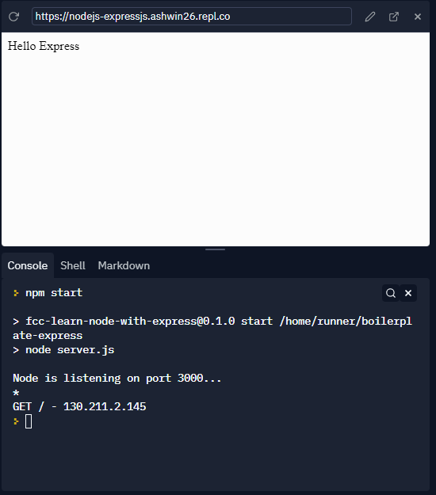
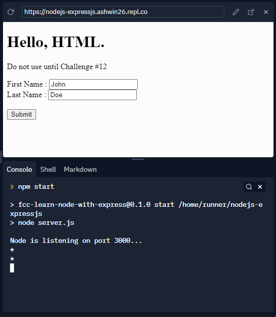
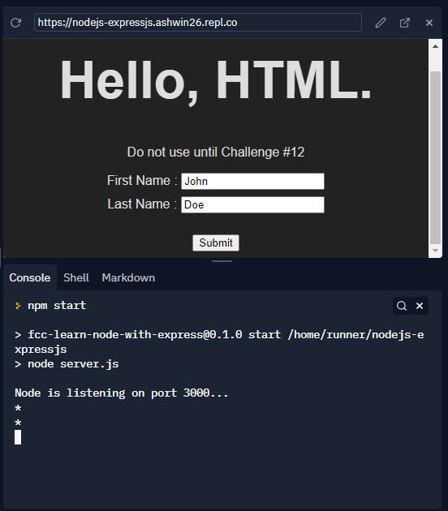
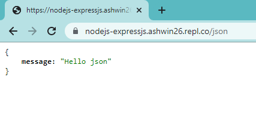
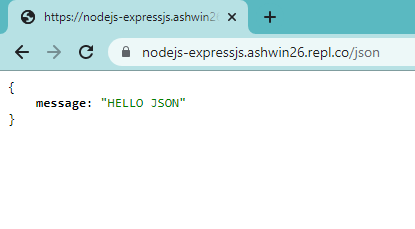

# NodeJS and ExpressJS scripts

- Node.js is a JavaScript runtime that allows developers to write backend (server-side) programs in JavaScript. 
- Node.js comes with a handful of built-in modules — small, independent programs — that help with this. 
- Some of the core modules include HTTP, which acts like a server, and File System, a module to read and modify files.


- Express is a lightweight web application framework, and is one of the most popular packages on npm. 
- Express makes it much easier to create a server and handle routing for your application, which handles things like direct people to the correct page when they visit a certain endpoint.


-The following scripts cover the basics of Node and Express including how to create a server, serve different files, and handle different requests from the browser.


## Source: freeCodeCamp course
- [Back End Development and APIs](https://www.freecodecamp.org/learn/back-end-development-and-apis)
- [Basic Node and Express](https://www.freecodecamp.org/learn/back-end-development-and-apis/#basic-node-and-express)


## Express app object

- To create an Express app object we use `require` to import and `express()` function to initialize the app

```aidl
var express = require('express');
var app = express();

```

- This object has several methods
- One fundamental method is `app.listen(port)`. 
- It tells your server to listen on a given port, putting it in running state.


## Express routes

- In Express, routes takes the following structure: 

`app.METHOD(PATH, HANDLER)`

- METHOD is an http method in lowercase. 
- PATH is a relative path on the server (it can be a string, or even a regular expression). 
- HANDLER is a function that Express calls when the route is matched. 
- Handlers take the form 

`function(req, res) {...}`, 

- where `req` is the request object, and `res` is the response object.
- For example, the handler:

```aidl
function(req, res) {
  res.send('Response String');
}
```

- will serve the string 'Response String'.


### Challenge 1

- Use the app.get() method to serve the string "Hello Express" to GET requests matching the / (root) path.
- Be sure that your code works by looking at the logs, then see the results in the preview if you are using Replit.


- Code

```aidl
var express = require('express');
var app = express();

app.get('/', function(req, res) {
	res.send("Hello Express");
});

module.exports = app;
```

- Output

<p>

</p>


## Serve an HTML File
- You can respond to requests with a file using the res.sendFile(path) method. 
- You can put it inside the app.get('/', ...) route handler. 
- Behind the scenes, this method will set the appropriate headers to instruct your browser on how to handle the file you want to send, according to its type. Then it will read and send the file. This method needs an absolute file path. We recommend you to use the Node global variable __dirname to calculate the path like this:

`absolutePath = __dirname + relativePath/file.ext`


### Challenge 2

- Send the /views/index.html file as a response to GET requests to the / path. 
- If you view your live app, you should see a big HTML heading (and a form that we will use later…), with no style applied.
- Note: Keep in mind that Express evaluates routes from top to bottom, and executes the handler for the first match. 


- Code

```aidl
var express = require('express');
var app = express();

app.get('/', function(req, res) {
	let path = __dirname + "/views/index.html";
	res.sendFile(path);
});

module.exports = app;
```


- Output

<p>

</p>


## Serve Static Assets

- An HTML server usually has one or more directories that are accessible by the user. 
- You can place there the static assets needed by your application (stylesheets, scripts, images).
- In Express, you can put in place this functionality using the middleware `express.static(path)`, where the `path` parameter is the absolute path of the folder containing the assets.


- Basically, **middleware** are functions that intercept route handlers, adding some kind of information. 
- A middleware needs to be mounted using the method `app.use(path, middlewareFunction)`. 
- The first path argument is optional. If you don’t pass it, the middleware will be executed for all requests.


### Challenge 3

- Mount the `express.static()` middleware to the path `/public` with `app.use()`. 
- The absolute path to the assets folder is `__dirname + /public`.
- Now your app should be able to serve a CSS stylesheet. 


- Code

```aidl
var express = require('express');
var app = express();

let path = __dirname + "/public";
app.use("/public", express.static(path));

module.exports = app;
```


- Output

<p>

</p>


## Serve JSON on a Specific Route
- While an HTML server serves HTML, an API serves data. 
- A REST (REpresentational State Transfer) API allows data exchange in a simple way, without the need for clients to know any detail about the server. 
- The client only needs to know where the resource is (the URL), and the action it wants to perform on it (the verb). 
- The GET verb is used when you are fetching some information, without modifying anything. 


- These days, the preferred data format for moving information around the web is JSON. 
- Simply put, JSON is a convenient way to represent a JavaScript object as a string, so it can be easily transmitted.


- Let's create a simple API by creating a route that responds with JSON at the path `/json`. 
- You can do it as usual, with the `app.get()` method. 
- Inside the route handler, use the method `res.json()`, passing in an object as an argument. 
- This method closes the request-response loop, returning the data. 
Behind the scenes, it converts a valid JavaScript object into a string, then sets the appropriate headers to tell your browser that you are serving JSON, and sends the data back.


- A valid object has the usual structure `{key: data}`. 
- data can be a number, a string, a nested object or an array. 
- data can also be a variable or the result of a function call, in which case it will be evaluated before being converted into a string.


### Challenge 4

- Serve the object `{"message": "Hello json"}` as a response, in JSON format, to GET requests to the `/json` route. 
- Then point your browser to `your-app-url/json`, you should see the message on the screen.


- Code

```aidl
var express = require('express')
var app = express();

var helloObj = {"message": "Hello json"};
app.get('/json', function(req, res) {
	res.json(helloObj);
});

module.exports = app;
```


- Output

<p>

</p>


## Use the .env File

- The `.env` file is a hidden file that is used to pass environment variables to your application. 
- This file is secret, no one but you can access it, and it can be used to store data that you want to keep private or hidden. 
- For example, you can store API keys from external services or your database URI. 
- You can also use it to store configuration options. By setting configuration options, you can change the behavior of your application, without the need to rewrite some code.


- The environment variables are accessible from the app as `process.env.VAR_NAME`. 
- The `process.env` object is a global Node object, and variables are passed as strings. 
- By convention, the variable names are all uppercase, with words separated by an underscore. 
- The `.env` is a shell file, so you don’t need to wrap names or values in quotes. 
- It is also important to note that *there cannot be space around the equals sign when you are assigning values to your variables*
- e.g. `VAR_NAME=value`. 
- Usually, you will put each variable definition on a separate line.


### Challenge 5

- Create a .env file in the root of your project directory, and store the variable `MESSAGE_STYLE=uppercase` in it.
- Then, in the `/json` GET route handler send the response object's message in uppercase if `process.env.MESSAGE_STYLE` equals uppercase. 
- The response object should either be `{"message": "Hello json"}` or `{"message": "HELLO JSON"}`, depending on the `MESSAGE_STYLE` value.

- Note: If you are using Replit, you cannot create a .env file. Instead, use the built-in SECRETS tab to add the variable.


- Code

```aidl
var express = require('express')
var app = express();

var helloObjLow = {"message": "Hello json"};
var helloObjUp = {"message": "HELLO JSON"};
app.get('/json', function(req, res) {
	const mySecret = process.env['MESSAGE_STYLE']
	if(mySecret == "uppercase") {
		res.json(helloObjUp);
	} else {
		res.json(helloObjLow);
	}
});

module.exports = app;
```


- Output

<p>

</p>
